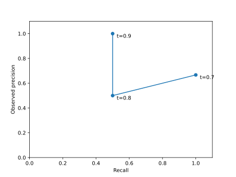

# Why detection backends produce different metrics

AP is backend-specific. Native assignment, Ultralytics validator assignment,
and COCO confidence-ordered assignment can produce different TP sequences.
Ultralytics uses 101-point integration; COCO averages a precision envelope over
101 recall thresholds and caps detections at 100 per image and class. The native
assignment and AP integration are configurable. Identical boxes therefore do
not guarantee identical AP, even when confidence thresholds agree.

This illustration uses a synthetic one-class sequence (TP at confidence 0.9,
FP at 0.8, TP at 0.7), with two GT boxes. It illustrates observed precision and
recall; it is not an original dataset measurement or a backend parity claim.
Reproduce it with `uv run python scripts/create_review_examples.py`.

With an explicit threshold `t`, both optional backends retain detections with
`confidence >= t`, re-match them using their respective assignment semantics,
and return exact `tp`, `fp`, `fn` alongside P/R/F1. AP still uses the complete
prediction set. Calibration searches observed confidence values, includes each
complete confidence tie group, and chooses the highest threshold when objectives
are equal. Ultralytics does not inherit COCO's maxDet cap.

Without an explicit threshold, backend P/R/F1 remain their native summary
readouts. They are not observed confusion counts. `DetectionMetrics.tp/fp/fn`
are absent; the compatibility `Metrics` adapter marks `counts_observed=False`
and leaves its Wilson confidence intervals unavailable (NaN). Use a held-out
calibration split to obtain observed counts and confidence intervals.

Compare AP only with the same backend, assignment, IoU thresholds, integration,
and detection limits. Compare operating points with the same retention rule and
backend matching semantics. See [backend contracts](backends.md) and
[the dated remediation ledger](review-remediation-2026-10-04.md).

Ultralytics `per_class` calibration uses deterministic coordinate ascent on the
realized whole-image macro-F1 when mixed-class IoU ties couple thresholds. Other
thresholds stay fixed during each sweep; candidates are the current class's
observed scores plus the highest dataset score. Sweeps repeat until no coordinate
improves, preferring higher thresholds on equal objectives. This guarantees a
coordinate-local optimum on that grid, without exhaustive joint optimality.
Global scalar calibration and independent COCO per-class calibration remain exact
on their observed-score grids. Cached IoUs and affected-image updates keep the
coordinate search from rematching unrelated images at every candidate.
